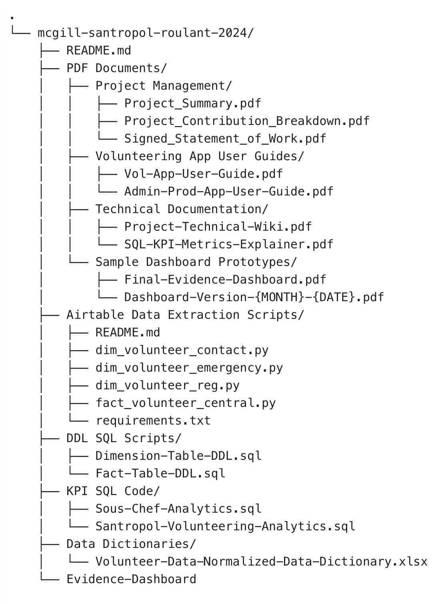

# mcgill-santropol-roulant-2024

## BUSA 649: Community Analytics Project

## Summer 2024

## Client: Santropol Roulant

## Hand-off Document

### Authors: [Jared Balakrishnan](mailto:vishak.balakrishnan@mail.mcgill.ca), [Moiz Shaikh](mailto:moiz.shaikh@mail.mcgill.ca)

Please refer to this document for a list of all artifacts related to the community project carried out by the authors during their partnership with the aforementioned client.

NOTE: The authors will be meeting with the client separately for a hand-off meeting where all materials will be directly shared with the client, mainly due to underlying data being restricted under NDA. The files listed below are being submitted solely for proof of work for the academic component of this project.

## Contents

The overall file tree for this submission package is as shown below. Each one of the folders in this tree is described in detail in the following subsections:

### PDF Documents

This folder contains 4 folders nested within. Each one of these folders and the files contained within are described below:

#### Project Management

* Project Summary: This document details the progress on each use case that was laid out by the client at the beginning of the project. Additionally, it also has future action items which have been discussed in detail, and agreed upon informally between the students and the client as of July 19, 2024.    
  ***Filename: Project_Summary.pdf***  
* Project Contribution Breakdown: This is a detailed breakdown of the tasks that comprised this project, broken down by operational and functional areas. Included since Dr. Serpa wishes to see this in order to better inform his individual grading.   
  ***Filename: Project_Contribution_Breakdown.pdf***
* Signed Statement of Work: This is merely a copy of the signed Statement of Work document that was drafted at the commencement of this project.

    ***Filename: Signed_Statement_of_Work.pdf***

#### Volunteering App User Guides

* Vol App User Guide: This document is a detailed user guide for any and all new volunteers signing up and registering for Meals on Wheels shifts at Santropol Roulant.   
  ***Filename: Vol-App-User-Guide.pdf***  
* Admin (Prod) App User Guide: This is a detailed user guide aimed at employees working with the Meals on Wheels program at Santropol Roulant in order to administer shifts.   
  ***Filename: Admin-Prod-App-User-Guide.pdf***

### Data Dictionaries

While better suited to be a part of the technical documentation, this folder contains the data dictionary generated by the cleaning, processing and normalization-denormalization of volunteer data resulting from the Airtable ETL process. Contains 9 individual spreadsheets within the workbook, one for each table generated.

  ***Filename: Volunteer-Data-Normalized-Data-Dictionary.xlsx***

#### Technical Documentation

* Technical Wiki: This document serves as a technical primer of the solution implemented by the authors; this is a useful read for anyone interested in getting acquainted with the technical implementation of the solution. The main intended audience however is any developer who may want to add to, or modify the source code for the project.   
  ***Filename**:* ***Project-Technical-Wiki.pdf***

#### Sample Dashboard Prototypes

* Final Sample Dashboard PDF: This PDF file contains a print-friendly version of the latest dashboard that is available on Evidence.   
  **Filename**: ***Final-Evidence-Dashboard.pdf***  
* The other files in the folder are previous prototypes of the dashboard, and are named according to the date on which they were created (as can be seen in the wildcard referenced in the below filename).
  **Filename**: ***Dashboard-Version-{MONTH}-{DATE}.pdf***

### Code Files

*The final, full version of these files are already being made available to the client through a **SEPARATE** GitHub repository, the link to which will be provided only to signatories of the NDA covering this project and henceforth will not be listed here*.

All of the code files associated with the project can be found in the folders described below:

* DDL SQL Scripts  
* Airtable Data Extraction Scripts  
* KPI SQL Code  
* Evidence-Dashboard

### DDL-SQL-Scripts

The following are the files enclosed within the aforementioned folder:

* Fact-Table-DDL.sql: This file contains the SQL script that creates the database FACT table which stores the Airtable data extracted from the client’s Airtable account. For more information on this FACT table, refer to the aforementioned Technical Wiki titled “***Project-Technical-Wiki.pdf***”.  
* Dimension-Table-DDL.sql: This file contains the SQL scripts that create the database DIMENSION tables generated as part of the data extraction from the client’s Airtable account. For more information on the Dimension tables, refer to the previously mentioned Technical Wiki document titled “***Project-Technical-Wiki.pdf***”.  
* **Please note that no underlying data is being shared in any of these documents.**

### Data-Extraction-Scripts

The following are a set of fully PEP-8 compliant .py Python script files. These files DO NOT require any file input. All that is needed to run these scripts is access to the client’s MySQL database. The files include:

* fact\_volunteer\_central.py \- This Python script cleans the Airtable API response and populates the following tables in the MySQL database:  
  * FACT\_VOLUNTEER\_CENTRAL  
  * DIM\_VOLUNTEER\_PGM\_PREFERENCES  
  * DIM\_VOLUNTEER\_KITCHEN\_SHIFT\_AVAILABILITY  
  * DIM\_VOLUNTEER\_SKILLS  
  * DIM\_VOLUNTEER\_DELIVERY\_PREFERENCES  
  * DIM\_VOLUNTEER\_DELIVERY\_SHIFT\_AVAILABILITY  
* dim\_volunteer\_reg\_form.py \- This Python script cleans the Airtable API response and populates the DIM\_VOLUNTEER\_FORM dimension table in the MySQL database.  
* dim\_volunteer\_emergency.py \- This Python script cleans the Airtable API response and populates the DIM\_VOLUNTEER\_ICE dimension table in the MySQL database.  
* dim\_volunteer\_contact.py \- This Python Script cleans the Airtable API response and populates the DIM\_VOLUNTEER\_CONTACT dimension table in the MySQL database.  
* requirements.txt \- This text file contains all of the required Python packages necessary to be able to build this project’s source code via a PyPI “pip install”.

### KPI-SQL-Code

The files in this folder contain a copy of all the SQL used to calculate the KPIs that end users can view on the dashboard:

* Sous-Chef-Analytics.sql \- This script contains analytics relating to Santropol Roulant’s clients (the population receiving meals as part of the organization’s Meals on Wheels program).  
* Santropol-Volunteering-Analytics.sql \- This script contains analytics relating to volunteer registrations at Santropol Roulant.

### Evidence-Dashboard

This folder contains the source code for the web application that serves the final dashboard to the end-user. 

The website’s page is contained in the file titled “***index.md***” in the ***pages*** folder. 

Instructions to clone the GitHub repository and host the final web application are made available to members working on the project who are signatories to the NDA.

After cloning the repository and connecting to the MySQL database, the client can view the webpage in a browser (if using localhost). The final hosting infrastructure will be decided by the client \- this will be the ultimate link that anyone who only uses the dashboard as read-only will need to have in hand to access the dashboard as well as the associated insights.

***PLEASE NOTE THAT NO DATA FILES ARE AVAILABLE AS PART OF THE SUBMISSION MADE VIA MYCOURSES \- THIS IS BECAUSE THE CLIENT HAS MADE IT CLEAR THAT THEIR DATA IS NOT TO BE SHARED WITH ANYONE OUTSIDE OF THE PROJECT.***  
